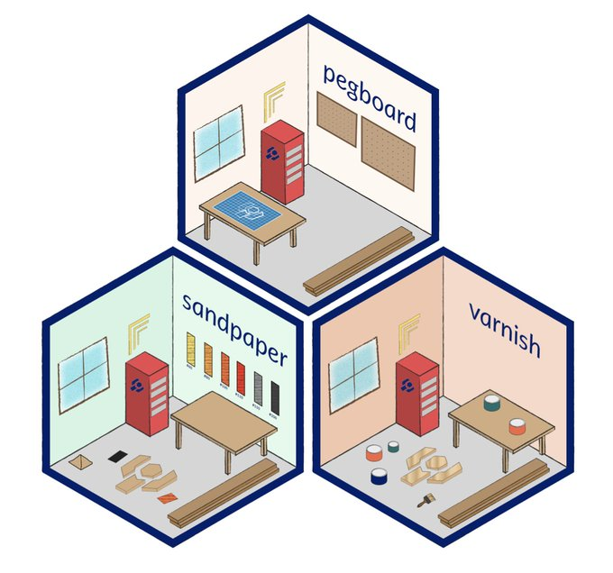

# The Carpentries Workbench Developer's Handbook

<figure style='text-align: center'>
<p>

</p>
<figcaption style='display: block'></p>The Workbench is an accessible lesson infrastructure built in R</p></figcaption>
</figure>

This is the source for [The Carpentries Workbench Developer's Handbook](https://carpentries.github.io/workbench-dev).

This site uses [quarto]. To build it locally, install quarto and run:

```
quarto render
```

[quarto]: https://quarto.org
